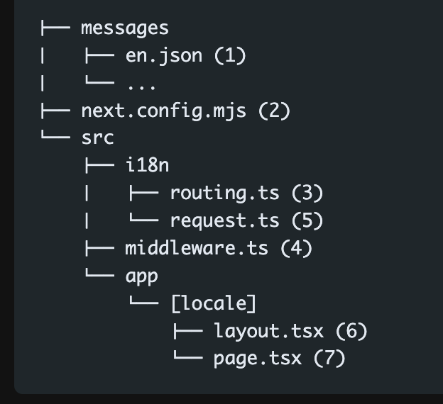

## Clerk 配置
web/app/login/[[...rest]]/page.tsx 是登录页面，用于处理登录和重定向，这样写文件目录的原因是因为，这是 Clerk 推荐的标准配置方式


## next-intl 配置，[App Router]

- 按照[官方文档]('https://next-intl.dev/')依次创建 message、i18n（request.ts,routing.ts）、middleware.ts 等文件

- 目录结构尽量按着这个来


- 配置完之后，项目会有一个错误，Route "/[locale]" used `params.locale`. `params` should be awaited before using its properties

这个错误是 Next.js 15.0.4 版本中的一个新要求。错误信息表示在使用动态路由参数 params.locale 之前需要先等待（await）它。这是因为在服务器组件中，params 是一个异步对象。

使用下面的命令，会将你的 `params` 转换为 `await params`，详细可以看[文档](https://nextjs.org/docs/messages/sync-dynamic-apis)
```bash
npx @next/codemod@canary next-async-request-api .
```